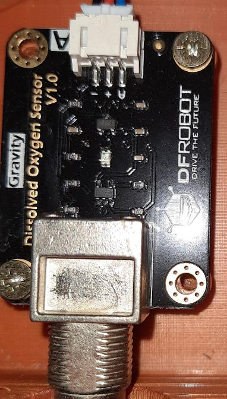
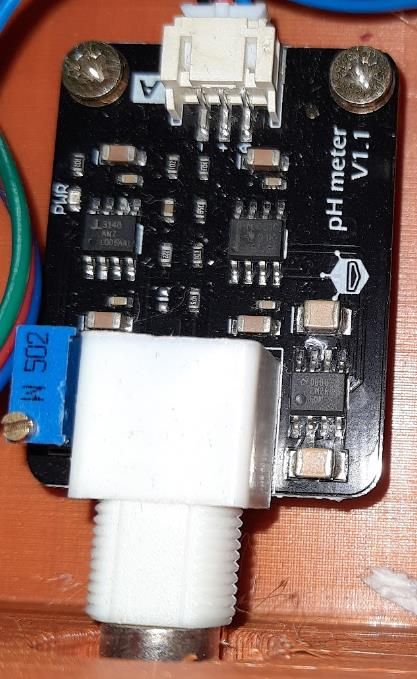

TECHNICAL DOCUMENTATION IS STILL IN BUILD PROCESS

components:

Technical Specifications of the analog dissolved oxygen sensor X-SEN0237-A

Supply Voltage: 3.3 V to 5 V
Output Signal: 0 V to 3 V
Probe Type: Galvanic
Detection Range: 0 to 20 mg/L
Response Time: Up to 98% within 90 s
Pressure Range: 0 to 50 PSI
Electrode Lifespan: 1 year
Maintenance Interval:
Membrane replacement: 1 to 2 months in turbid water, 4 to 5 months in clear water
Solution replacement: Once a month
Cable Length: 2 m
Probe Connector: BNC
Signal Connector: Gravity analog interface
Board Size: 42 x 32 mm

Technical Specifications of  Analog pH Sensor SEN0161

Supply Voltage: 5 V
Measurement Range: 0 pH to 14 pH
Operating Temperature: 0 °C to 60 °C
Accuracy: +/- 0.1 pH (at 25 °C)
Response Time: Up to 1 minute
pH Sensor with BNC Connector
Interface: PH2.0
Gain Adjustment: Via potentiometer
Cable for Connection to DFRobot IO Expansion Shield
Board Size: 43 x 32 mm

Technical Specifications of  peristaltic pump DFR0523

Motor Driver Specifications

Input Voltage: 5 - 6 V
Max Continuous Operating Current: 1.8 A
Peak Current: 2.5 A
Idle Current: < 1 mA
PPM Signal Resolution: 1 µs
PPM Signal Positive Pulse Width: 500 µs - 2500 µs
Pulse Width Range - Movement: 500 µs - 1400 µs (500 µs: maximum speed)
Pulse Width Range - Stop: 1400 µs - 1600 µs
Reversed Pulse Width Range: 1600 µs - 2500 µs (2500 µs: maximum speed)
PPM Signal Frequency: 50 Hz (servo control signal)
Connector: Gravity
Size: 27.4 x 28.7 mm

Peristaltic Pump Specifications

Drive Type: DC motor
Rated Voltage: 6 V
Rated Power: 5 W

Tube parameter:

Tube Material: BPT (Biocompatible Polymer Tubing)
Inner Diameter: 2.5 mm
Outer Diameter: 4.5 mm
Pump Material: Plastic
Pulsation: 3 rollers, low pulsation
Flow Rate: > 45 ml/min
Operating Temperature: 0 to 40 °C

Arduino Uno Rev3 microcontroller:
Supply voltage: 7V to 12V
Model: Arduino Uno
Microcontroller: ATmega328
Maximum clock frequency: 16 MHz
SRAM memory: 2 kB
Flash memory: 32 kB (5 kB reserved for bootloader)
EEPROM memory: 1 kB

XL4016 step down converter

Converter type: Step-down
Input voltage: 5 – 40 V
Output voltage: 1.25 – 36 V (adjustable)
Converter chip: XL4016
Output current: 0 – 5 A
Maximum output current: 8 A (with heatsink, included)
Maximum output power: 250W
Power LED
Reverse polarity protection.
Efficiency: Max 95%
Frequency: 180 kHz
Built-in voltmeter to measure the output voltage
Operating temperature: -40 ÷ 85 °C
Mounting holes
Dimensions: 60 x 37 mm

2-channel HW-95 L298N motor controller

1 Driver chip: L298N dual H-bridge driver chip
2 Terminal driver part of the supply area VMS: +5V ~ +35V
3 Drive part of the peak current Io: 2A / Bridge
4 Logical part of the terminal power supply range Vss :4.5-5 .5V
5 Logical part of the operating current range: 0 - 36mA
6 The control signal input voltage range: 4.5-5.5V low 0V high
7 Maximum power consumption: 20W
8 Storage temperature: -25 to +130
9 Driver Board Size: 55mm * 60mm * 30mm
10 Driver board Weight: 33g
11 Other features: control direction indicator, power indicator, current detection, logical part of
the plate to take power interface.